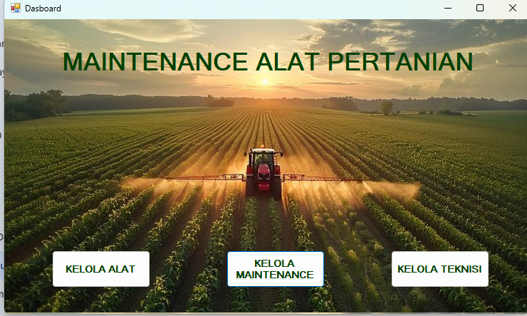
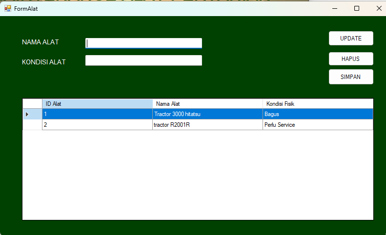
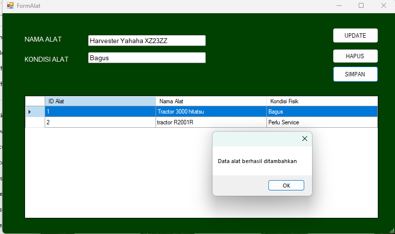
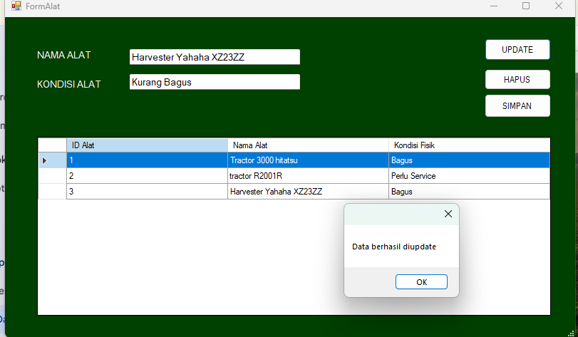

# NamaTim_NyawitSistemMaintenanceAlatPertanian

Sistem Informasi Manajemen Data Maintenance Alat Pertanian berbasis Desktop (Windows Forms) menggunakan C# dan SQL Server. Aplikasi ini digunakan untuk mencatat aset alat, teknisi, dan riwayat perbaikan alat pertanian.

## Teknologi yang Digunakan
* **Bahasa Pemrograman:** C# (.NET Framework)
* **Database:** Microsoft SQL Server
* **Arsitektur:** ADO.NET (SqlDataReader & ExecuteNonQuery)
* **IDE:** Visual Studio

---

## Dokumentasi & Hasil Menjalankan Sistem

### 1. Form Utama (Dashboard & Bukti Koneksi)
*Dashboard utama saat aplikasi dijalankan, membuktikan aplikasi tidak crash dan koneksi Integrated Security berhasil.*

### 2. Form Input Data
*Tampilan form Kelola Maintenance yang siap untuk menerima input data baru.*

### 3. Form Tampilan Data (DataGrid)
*Tampilan DataGridView yang berhasil memuat data dari database SQL Server.*

### 4. Bukti Proses CRUD (Create, Read, Update, Delete)

**A. Bukti Insert (Simpan Data)**

**B. Bukti Update (Perbarui Data)**

**C. Bukti Delete (Hapus Data)**

